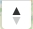
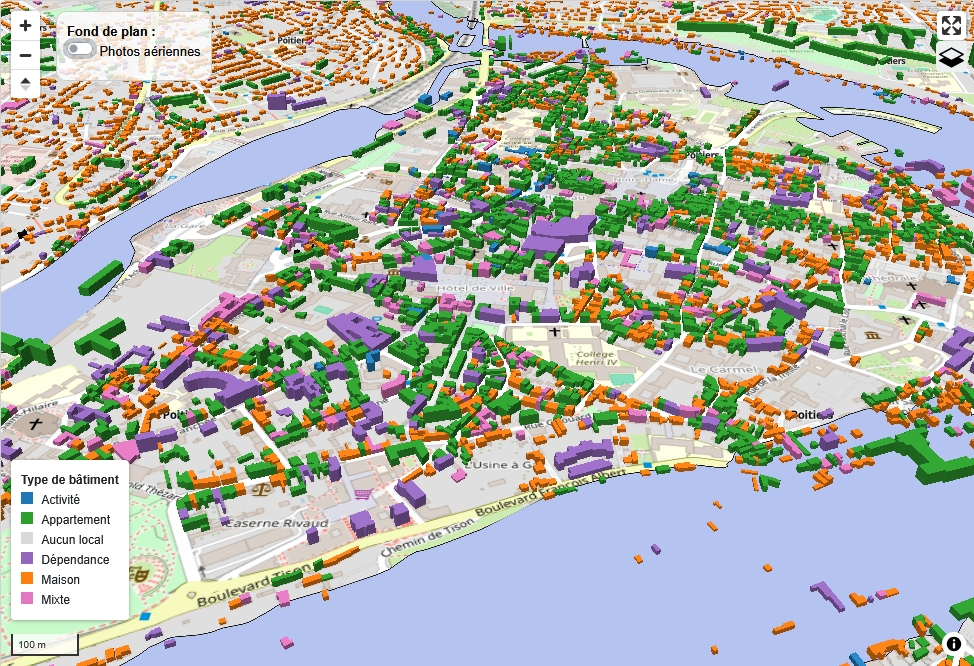

```{ojs}
//| echo: false
//| output: false
bbox_sru = FileAttachment("layers/bb.json").json()
```

```{=html}
<style>

/* ----------------------------- */
/*        COLLAPSE MODERNE       */
/* ----------------------------- */

.collapse-box {
  margin: 30px 0;
  border-radius: 18px;
  background: rgba(255,255,255,0.55);
  border: 1px solid rgba(255,255,255,0.35);
  box-shadow: 0 8px 32px rgba(0,0,0,0.12);
  backdrop-filter: blur(12px);
  -webkit-backdrop-filter: blur(12px);
  overflow: hidden;
}

/* Header */
.collapse-header {
  display: flex;
  justify-content: space-between;
  align-items: center;
  padding: 22px 28px;
  cursor: pointer;
  font-family: "Inter", "Avenir", sans-serif;
  font-size: 1.2rem;
  font-weight: 600;
  color: #333;
  background: rgba(255,255,255,0.4);
  transition: background 0.25s ease;
}

.collapse-header:hover {
  background: rgba(255,255,255,0.6);
}

.collapse-header span:first-child {
  padding-left: 44px;
  opacity: 0.8;
}

/* Arrow */
.collapse-arrow {
  width: 20px;
  height: 20px;
  transition: transform 0.35s ease, opacity 0.25s ease;
  opacity: 0.7;
}

.collapse-header.active .collapse-arrow {
  transform: rotate(90deg);
  opacity: 1;
}

/* Content */
.collapse-content {
  max-height: 0;
  overflow: hidden;
  transition: max-height 0.45s ease, padding 0.3s ease;
  padding: 0;
}

.collapse-content.open {
  padding: 25px 0 35px 0;
}

/* Inner box */
.collapse-inner {
  margin: 0 auto;
  max-width: 1100px;
  border: 1px solid #ddd;
  border-radius: 14px;
  padding: 35px;
  background: #fff;
}

/* Columns */
.flex-columns {
  display: flex;
  justify-content: space-between;
  align-items: flex-start;
  gap: 40px;
}

@media (max-width: 1052px) {
  .flex-columns {
    flex-direction: column;
    gap: 25px;
  }
}

</style>

<div class="collapse-box" id="collapse_indicateur" style="display:none;">

  <h1 style="color:orangered; font-size:1.5rem; margin: 20px; font-family:avenir; opacity: 0.7;">
    Nombre de personnes occupant des bâtiments de plain-pied fortement inondables
  </h1>

  <!-- TITRE CLIQUABLE -->
  <div class="collapse-header">
    <span>Plus d'informations concernant cet indicateur</span>

    <!-- Flèche SVG moderne -->
    <svg class="collapse-arrow" viewBox="0 0 24 24">
      <path d="M8 5l8 7-8 7" fill="none" stroke="currentColor" stroke-width="2" stroke-linecap="round" stroke-linejoin="round"/>
    </svg>
  </div>

  <!-- CONTENU DÉPLIANT -->
  <div class="collapse-content">

    <div style="
      margin-left:10vw; 
      margin-right:10vw; 
      margin-top:20px; 
      border:1px solid #ddd; 
      border-radius:10px; 
      padding:30px; 
      background-color:white;
    ">

      <div class="flex-columns" style="display:flex; justify-content:space-between; align-items:flex-start; gap:40px;">

        <!-- COLONNE GAUCHE -->
        <div style="flex:1;">

          <p style="font-size:1.1em; font-family:avenir;">
            Le niveau des eaux peut monter relativement vite pour piéger des personnes dans des locaux ne disposant pas d’un accès vers un étage refuge.
          </p>

          <a href="https://fiches.eptb-vienne.fr/ind_12a.pdf" target="_blank"
             style="display:block; margin-bottom:14px; text-align:left; font-size:1.05em;">
            <i class="fa fa-exclamation-circle"></i> Télécharger la fiche indicateur et la carte
          </a>

        </div>

        <!-- COLONNE DROITE -->
        <div style="flex:0 0 35%;">

          <p style="
              padding:12px; 
              border:1px solid #ddd; 
              border-radius:12px; 
              background:#f7f7f7; 
              font-size:1.05em; 
              text-align:center;
            ">
            La zone inondable correspond à l'aléa centennal construit à partir des données disponibles et notamment réglementaires mais en aucun cas             ne se substitue aux documents réglementaires en vigueur.
          </p>

        </div>

      </div>

    </div>

  </div>
</div>

<script>
document.querySelectorAll(".collapse-header").forEach(header => {
  const content = header.nextElementSibling;

  header.addEventListener("click", () => {
    header.classList.toggle("active");

    if (content.style.maxHeight) {
      content.style.maxHeight = null;
      content.classList.remove("open");
    } else {
      content.style.maxHeight = content.scrollHeight + "px";
      content.classList.add("open");
    }
  });

  // ⭐ ResizeObserver correctement attaché
  const ro = new ResizeObserver(() => {
    if (content.classList.contains("open")) {
      content.style.maxHeight = content.scrollHeight + 20 + "px";
    }
  });

  ro.observe(content);
});

</script>
```

```{ojs}
//| echo: false
//| output: false

bassin_vienne = FileAttachment("layers/bassin_vienne.geojson").json();
departement = FileAttachment("layers/departement.geojson").json();
region = FileAttachment("layers/region.geojson").json();
epci = FileAttachment("layers/epci.geojson").json();
perimetre = FileAttachment("layers/perimetre.json").json();
slgri = FileAttachment("layers/slgri.json").json();
tri = FileAttachment("layers/tri.geojson").json();
perimetre_papi = FileAttachment("layers/perimetre_papi.geojson").json();
indicateursGeojson = FileAttachment("layers/indicateurs.geojson").json();
```

```{ojs}
//| echo: false
//| padding: 0px
//| expandable: false
//| fill: true
//| 
map = {
  const container = html`<div class="map-container" id="map"></div>`;
  yield container;
  
  // add the PMTiles plugin to the maplibregl global.
    const protocol = new pmtiles.Protocol();
    maplibregl.addProtocol('pmtiles', (request) => {
        return new Promise((resolve, reject) => {
            const callback = (err, data) => {
                if (err) {
                    reject(err);
                } else {
                    resolve({data});
                }
            };
            protocol.tile(request, callback);
        });
    });
  

  <!-- const sourcePlanIGN = { -->
  <!--   style: 'normal', -->
  <!--   format: 'image/png', -->
  <!--   layer: 'GEOGRAPHICALGRIDSYSTEMS.PLANIGNV2' -->
  <!-- }; -->

  const sourceOrtho = {
    style: 'normal',
    format: 'image/jpeg',
    layer: 'HR.ORTHOIMAGERY.ORTHOPHOTOS'
  };

  const map = new maplibregl.Map({
    container: container,
    //style: 'https://basemaps.cartocdn.com/gl/voyager-gl-style/style.json',
    style: {
    version: 8,
    sources: {},
    layers: []
  },
    <!-- center: [-0.04, 46.3051],  -->
    zoom: 11
  });
  
  
      // Barre de recherche adresses et parcelles -----------
  
      // ==================== PÉRIMÈTRE ====================
      // Emprise du PAPI Vienne-Clain [ouest, sud, est, nord]
      const PERIMETRE = [-0.15, 46.40, 0.70, 46.80];
      const [west, south, east, north] = PERIMETRE;
      
      const dansPerimetre = ([lon, lat]) =>
        lon >= west && lon <= east && lat >= south && lat <= north;
      
      // ==================== OUTILS GÉOMÉTRIQUES ====================
      const centreGeom = (bb) => [(bb[0] + bb[2]) / 2, (bb[1] + bb[3]) / 2];
      
      function bboxGeom(geom) {
        const pts = geom.type === 'Polygon' ? geom.coordinates.flat() : geom.coordinates.flat(2);
        const xs = pts.map(p => p[0]), ys = pts.map(p => p[1]);
        return [Math.min(...xs), Math.min(...ys), Math.max(...xs), Math.max(...ys)];
      }
      
      // ==================== ADRESSES (Géoplateforme IGN / BAN) ====================
        async function chercherAdresse(query, signal) {
          const cLon = (west + east) / 2, cLat = (south + north) / 2;
          const url = `https://data.geopf.fr/geocodage/search?q=${encodeURIComponent(query)}` +
            `&index=address&limit=15&lat=${cLat}&lon=${cLon}`;
          const r = await fetch(url, { signal });
          if (!r.ok) return [];
          const gj = await r.json();
        
          return (gj.features || []).map(f => {
            const p = f.properties;
            const center = f.geometry.coordinates;      // point exact du numéro si trouvé
            return {
              type: 'Feature',
              geometry: { type: 'Point', coordinates: center },
              place_name: p.label,
              text: p.label,
              properties: p,                            // p.type : housenumber | street | municipality…
              place_type: ['address'],
              center
            };
          });
        }
      
      // ==================== PARCELLES (geo.api.gouv + API Carto) ====================
      // Analyse "AB 12 Poitiers" ou "Poitiers AB 12"
      function analyserParcelle(q) {
        q = q.trim();
        let m = q.match(/^([A-Za-z]{1,2})\s*0*(\d{1,4})\s+(.{2,})$/);     // section numéro commune
        if (m) return { section: m[1], numero: m[2], commune: m[3] };
        m = q.match(/^(.{2,}?)\s+([A-Za-z]{1,2})\s*0*(\d{1,4})$/);        // commune section numéro
        if (m) return { section: m[2], numero: m[3], commune: m[1] };
        return null;
      }
      
      async function chercherParcelles(query, signal) {
        const a = analyserParcelle(query);
        if (!a) return [];
      
        const section = a.section.toUpperCase().padStart(2, '0');
        const numero  = a.numero.padStart(4, '0');
      
        // 1. Commune(s) correspondante(s)
        const rc = await fetch(
          `https://geo.api.gouv.fr/communes?nom=${encodeURIComponent(a.commune)}` +
          `&fields=nom,code,centre&boost=population&limit=3`, { signal });
        const communes = (await rc.json()).filter(c => c.centre && dansPerimetre(c.centre.coordinates));
      
        // 2. Parcelle dans chaque commune
        const resultats = await Promise.all(communes.map(async c => {
          const url = `https://apicarto.ign.fr/api/cadastre/parcelle?code_insee=${c.code}` +
                      `&section=${section}&numero=${numero}`;
          const r = await fetch(url, { signal });
          if (!r.ok) return [];
          const gj = await r.json();
          return (gj.features || []).map(f => {
            const bb = bboxGeom(f.geometry);
            const center = centreGeom(bb);
            const nom = `Parcelle ${section} ${numero} – ${c.nom}`;
            return {
              type: 'Feature',
              geometry: { type: 'Point', coordinates: center },
              place_name: nom,
              text: nom,
              properties: f.properties,
              place_type: ['parcel'],
              center,
              bbox: bb
            };
          });
        }));
        return resultats.flat();
      }
      
      // ==================== MODE DE RECHERCHE ====================
      let mode = 'adresse';   // 'adresse' | 'parcelle'
      
      const PLACEHOLDERS = {
        adresse:  'Rechercher une adresse (ex. 10 rue de la Cathédrale, Poitiers)…',
        parcelle: 'Rechercher une parcelle (ex. AB 12 Poitiers)…'
      };
      
      const geocoderApi = {
        forwardGeocode: async (config) => {
          const signal = AbortSignal.timeout(8000);
          try {
            const features = mode === 'parcelle'
              ? await chercherParcelles(config.query, signal)
              : await chercherAdresse(config.query, signal); 
            return { features: features.filter(f => dansPerimetre(f.center)) };
          } catch (e) {
            console.error('forwardGeocode a échoué :', e);
            return { features: [] };
          }
        }
      };
      
        // ==================== BOUTON RETOUR À LA VUE INITIALE ====================
    class ResetViewControl {
      constructor(opts = {}) { this.opts = opts; }
    
      onAdd(map) {
        this._map = map;
        this._container = document.createElement('div');
        this._container.className = 'maplibregl-ctrl maplibregl-ctrl-group';
    
        const btn = document.createElement('button');
        btn.type = 'button';
        btn.className = 'ctrl-reset-view';
        btn.title = 'Revenir à la vue initiale';
        btn.setAttribute('aria-label', 'Revenir à la vue initiale');
        btn.innerHTML = `
          <svg viewBox="0 0 24 24" width="18" height="18" fill="none" stroke="currentColor"
               stroke-width="2" stroke-linecap="round" stroke-linejoin="round">
            <path d="M3 11l9-8 9 8"/><path d="M5 10v10h5v-6h4v6h5V10"/>
          </svg>`;
    
        btn.addEventListener('click', () => {
          map.fitBounds(this.opts.bounds, {
            padding: this.opts.padding ?? 40,
            bearing: 0, pitch: 0,
            essential: true
          });
          this.opts.onReset?.();
        });
    
        this._container.appendChild(btn);
        return this._container;
      }
    
      onRemove() { this._container.remove(); this._map = undefined; }
    }
    
    // Utilise l'emprise du PAPI définie plus haut
    map.addControl(
      new ResetViewControl({
        bounds: [[west, south], [east, north]],
        <!-- onReset: () => geocoder.clear()      // optionnel : vide aussi la recherche -->
      }),
      'top-left'
    );
      
      const geocoder = new MaplibreGeocoder(geocoderApi, {
        maplibregl,
        placeholder: PLACEHOLDERS[mode],
        showResultsWhileTyping: true,
        minLength: 3,
        debounceSearch: 300,
        flyTo: false
      });
      map.addControl(geocoder, 'top-left');
      
      // ==================== SOUS-BARRE ADRESSE / PARCELLE ====================
      // ==================== PANNEAU DE MODE (Adresse / Parcelle) ====================
      const HINTS = {
        adresse:  'Ex. : 10 rue de la Cathédrale, Poitiers',
        parcelle: 'Ex. : AB 12 Poitiers (section, numéro, commune)'
      };
      
      const geoContainer = document.querySelector('.maplibregl-ctrl-geocoder');
      const geoInput = geoContainer.querySelector('input');
      
      const panel = document.createElement('div');
      panel.className = 'geo-panel';
      panel.dataset.mode = mode;
      panel.innerHTML = `
        <div class="geo-seg" role="tablist" aria-label="Type de recherche">
          <span class="geo-thumb"></span>
          <button type="button" role="tab" data-mode="adresse" aria-selected="true">
            <svg viewBox="0 0 24 24" width="16" height="16" fill="none" stroke="currentColor"
                 stroke-width="2" stroke-linecap="round" stroke-linejoin="round">
              <path d="M12 21s-7-6.2-7-11a7 7 0 0 1 14 0c0 4.8-7 11-7 11z"/><circle cx="12" cy="10" r="2.5"/>
            </svg>Adresse
          </button>
          <button type="button" role="tab" data-mode="parcelle" aria-selected="false">
            <svg viewBox="0 0 24 24" width="16" height="16" fill="none" stroke="currentColor"
                 stroke-width="2" stroke-linecap="round" stroke-linejoin="round">
              <path d="M4 5l6-2 4 2 6-2v16l-6 2-4-2-6 2z"/><path d="M10 3v16M14 5v16"/>
            </svg>Parcelle
          </button>
        </div>
        <p class="geo-hint">${HINTS[mode]}</p>`;
      geoContainer.appendChild(panel);
      
      const hint = panel.querySelector('.geo-hint');
      
      function setMode(m) {
        mode = m;
        panel.dataset.mode = m;
        geoInput.placeholder = PLACEHOLDERS[m];
        hint.textContent = HINTS[m];
        panel.querySelectorAll('button').forEach(b =>
          b.setAttribute('aria-selected', b.dataset.mode === m));
        geoInput.focus();
        if (geoInput.value.trim().length >= 3) geocoder.query(geoInput.value.trim());
      }
      
      panel.addEventListener('mousedown', e => e.preventDefault()); // le champ garde le focus
      panel.addEventListener('click', e => {
        const b = e.target.closest('button[data-mode]');
        if (b) setMode(b.dataset.mode);
      });
      
      geoInput.addEventListener('focus', () => geoContainer.classList.add('geo-open'));
      document.addEventListener('mousedown', e => {
        if (!geoContainer.contains(e.target)) geoContainer.classList.remove('geo-open');
      });


  // Utile pour le bouton latérale Couche indicateur --------------
  window.map = map;
    
  map.addControl(new maplibregl.FullscreenControl(), 'top-right');
  map.addControl(new maplibregl.NavigationControl({ visualizePitch: true }), 'top-right');
  map.addControl(new maplibregl.ScaleControl({ maxWidth: 80, unit: 'metric' }));
  

  map.on('load', () => {
    map.fitBounds(
    [
      [-0.04, 46.3051],   // Sud-Ouest
      [0.7741, 46.8565]   // Nord-Est
    ],
    {
      padding: 20,
      linear: true,
      duration: 0
    }
  );
    // Ajout des fonds raster IGN
    <!-- map.addSource('raster-planign', { -->
    <!--   type: 'raster', -->
    <!--   tiles: [ -->
    <!--     `https://data.geopf.fr/wmts?SERVICE=WMTS&style=${sourcePlanIGN.style}&VERSION=1.0.0&REQUEST=GetTile&format=${sourcePlanIGN.format}&layer=${sourcePlanIGN.layer}&tilematrixset=PM&TileMatrix={z}&TileCol={x}&TileRow={y}` -->
    <!--   ], -->
    <!--   tileSize: 256, -->
    <!--   attribution: '© <a href="https://www.ign.fr/">IGN</a>', -->
    <!--   minzoom: 0, -->
    <!--   maxzoom: 22 -->
    <!-- }); -->

    map.addSource('raster-ortho', {
      type: 'raster',
      tiles: [
        `https://data.geopf.fr/wmts?SERVICE=WMTS&style=${sourceOrtho.style}&VERSION=1.0.0&REQUEST=GetTile&format=${sourceOrtho.format}&layer=${sourceOrtho.layer}&tilematrixset=PM&TileMatrix={z}&TileCol={x}&TileRow={y}`
      ],
      tileSize: 256,
      attribution: '© <a href="https://www.ign.fr/">IGN</a>',
      minzoom: 0,
      maxzoom: 22
    });
    
    map.addSource('raster-osm', {
  type: 'raster',
  tiles: [
    'https://tile.openstreetmap.org/{z}/{x}/{y}.png'
  ],
  tileSize: 256,
  attribution:
    '© <a href="https://www.openstreetmap.org/copyright">OpenStreetMap</a> contributors',
  minzoom: 0,
  maxzoom: 19
    });

    <!-- map.addLayer({ -->
    <!--   id: 'planIGN', -->
    <!--   type: 'raster', -->
    <!--   source: 'raster-planign', -->
    <!--   layout: { visibility: 'visible' } -->
    <!-- }); -->

    map.addLayer({
      id: 'orthoIGN',
      type: 'raster',
      source: 'raster-ortho',
      layout: { visibility: 'none' }
    });
    
     map.addLayer({
      id: 'OSM',
      type: 'raster',
      source: 'raster-osm',
      layout: { visibility: 'visible' } // tu peux le laisser caché au départ si tu veux le basculer ensuite
    });
    
    //fetch('layers/indicateurs.geojson')
     //.then(response => response.json())
     //.then(indicateursGeojson => { 
              
    
    const layersData = [
      { data: bassin_vienne, type: 'line', id: 'bassinvienneLayer', color: 'green', layout: {visibility:'none'}},
      { data: region, type: 'line', id: 'regionLayer', color: 'red', layout: {visibility:'none'} },
      { data: departement, type: 'line', id: 'departementLayer', color: '#a772b9', width: 2,  layout:{visibility:'none'}},
      { data: epci, type: 'line', id: 'epciLayer', color: '#567ae3', layout: {visibility:'none'} },
      { data: perimetre_papi, type: 'line', id: 'perimetrepapiLayer', color: 'black', layout: {visibility:'none'} },
      { data: indicateursGeojson, // GeoJSON contenant une propriété 's12a' -->
        type: 'fill',
        id: 'indicateurs12aLayer',
        opacity: 0.5,
        width: 1,
        dynamicColor: { 
        property: 's12a',
        mapping: { 
           //'-1': '#f1eeed',
           //'0': '#ffffff', 
           '10': '#ffffff',
           '50': '#ffaaaa', 
           '100': '#ff5555'
          }, 
         default: '#d9d9d9'
        }
        , layout: {visibility:'visible'}
         },
      {
        pmtiles: true,
        source: "coursdeau",
        sourceLayer: "coursdeau_perimetre_papi_vc",
        type: "line",
        id: "coursdeauLayer",
        color: "#1f78b4",
        width: [
              "interpolate",
              ["linear"],
              ["zoom"],
              8, 1.2,
              12, 2,
              16, 3
            ],
        opacity: 0.8,
        layout: {
          visibility: "visible"
        }
      },
        { 
          pmtiles: true, 
          source: "parcelles",
          sourceLayer: "parcelles", 
          type: "fill", 
          id: "parcellesLayer", 
          color: "#b4c3ef", 
          opacity: 0.5, 
          layout: { 
          visibility: "none"
          } 
            }, 
      {
        pmtiles: true,
        source: "zoneinondable",
        sourceLayer: "zi_perimetre_papi_vc",
        type: "fill",
        id: "zoneinondableLayer",
        color: "#b4c3ef",
        opacity: 0.5,
        layout: {
          visibility: "none"
        }
      },
      {
        pmtiles: true,
        source: "ruissellement2d",
        sourceLayer: "ruissellement_cartino2d",
        type: "fill",
        id: "ruissellementcartino2dLayer",
        color: "#b4c3ef",
        opacity: 0.5,
        layout: {
          visibility: "none"
        }
      },
      
    {
        pmtiles: true,
        source: "communepapi",
        sourceLayer: "communes_zone_papi",
        type: "fill",
        id: "communepapiLayer",
        color: "#ff8800",
        opacity: 0.5,
        layout: {
          visibility: "none"
        }
      },
      <!-- { -->
      <!--   pmtiles: true, -->
      <!--   source: "ruissellementexzeco", -->
      <!--   sourceLayer: "ruissellement_exzeco", -->
      <!--   type: "fill", -->
      <!--   id: "ruissellementexzecoLayer", -->
      <!--   color: "#b4c3ef", -->
      <!--   opacity: 0.5, -->
      <!--   layout: { -->
      <!--     visibility: "none" -->
      <!--   } -->
      <!-- }, -->
      {
        pmtiles: true,
        source: "batiments",
        sourceLayer: "batiments_hauteur",
        type: "fill-extrusion",
        id: "batimentsLayer",
        opacity: 0.9,
        heightProperty: "hauteur",
        colorByType: "ff_dteloctxt",
        layout: {
          visibility: "none"
        }
      }
    ];
    
    /* ============================================================
           LÉGENDE POPULATION
        ============================================================ */
        
        const legend = document.createElement("div");
        legend.id = "legend";
        legend.style.cssText = `
          position:absolute;
          bottom:60px;          /* position normale en bas */
          left:10px;
          background:white;
          padding:10px;
          font-size:12px;
          border-radius:4px;
          box-shadow:0 1px 4px rgba(0,0,0,0.3);
          z-index:10;
        `;
        
        legend.innerHTML = `
          <strong>Population en zone <br>fortement inondable</strong><br>
          <div><span style="background:#d9d9d9;width:12px;height:12px;display:inline-block;margin-right:5px;"></span> 0</div>
          <div><span style="background:#ffffff;width:12px;height:12px;display:inline-block;margin-right:5px;border:1px solid #ccc;"></span> < 10 </div>
          <div><span style="background:#ffaaaa;width:12px;height:12px;display:inline-block;margin-right:5px;"></span> 10-50 </div>
          <div><span style="background:#ff5555;width:12px;height:12px;display:inline-block;margin-right:5px;"></span> 50-100 </div>
          <div><span style="background:#ff0000;width:12px;height:12px;display:inline-block;margin-right:5px;"></span> > 100 </div>
        `;
        
        map.getContainer().appendChild(legend);
        
        
        /* ============================================================
           LÉGENDE BÂTIMENTS
        ============================================================ */
        
        const batimentLegend = document.createElement("div");
        batimentLegend.id = "batiment-legend";
        batimentLegend.style.cssText = `
          position:absolute;
          bottom:60px;          /* même base */
          left:10px;
          background:white;
          padding:10px;
          font-size:12px;
          border-radius:4px;
          box-shadow:0 1px 4px rgba(0,0,0,0.3);
          z-index:10;
          display:none;
        `;
        
        batimentLegend.innerHTML = `
          <strong>Type de bâtiment</strong><br>
          <div><span style="background:#1f77b4;width:12px;height:12px;display:inline-block;margin-right:5px;"></span> Activité</div>
          <div><span style="background:#2ca02c;width:12px;height:12px;display:inline-block;margin-right:5px;"></span> Appartement</div>
          <div><span style="background:#d9d9d9;width:12px;height:12px;display:inline-block;margin-right:5px;"></span> Aucun local</div>
          <div><span style="background:#9467bd;width:12px;height:12px;display:inline-block;margin-right:5px;"></span> Dépendance</div>
          <div><span style="background:#ff7f0e;width:12px;height:12px;display:inline-block;margin-right:5px;"></span> Maison</div>
          <div><span style="background:#e377c2;width:12px;height:12px;display:inline-block;margin-right:5px;"></span> Mixte</div>
        `;
        
        map.getContainer().appendChild(batimentLegend);
        
        
        /* ============================================================
           POSITIONNEMENT INTELLIGENT (bas à gauche)
        ============================================================ */
        
        function updateLegendPositions() {
          const popVisible = legend.style.display !== "none";
          const batVisible = batimentLegend.style.display !== "none";
        
          if (popVisible && batVisible) {
            // Les deux visibles → on empile proprement
            legend.style.bottom = "230px";          // légende population en haut
            batimentLegend.style.bottom = "60px";  // légende bâtiment en bas
          }
          else if (popVisible && !batVisible) {
            legend.style.bottom = "60px";          // position normale
          }
          else if (!popVisible && batVisible) {
            batimentLegend.style.bottom = "120px";  // position normale
          }
        }
        
        
        /* ============================================================
           VISIBILITÉ POPULATION
        ============================================================ */
        
        function updateLegendVisibility() {
          const visibility = map.getLayoutProperty("indicateurs12aLayer", "visibility");
          legend.style.display = (visibility === "none") ? "none" : "block";
          updateLegendPositions();
        }
        
        
        /* ============================================================
           VISIBILITÉ BÂTIMENTS
        ============================================================ */
        
        function updateBatimentLegendVisibility() {
          const visibility = map.getLayoutProperty("batimentsLayer", "visibility");
          batimentLegend.style.display = (visibility === "none") ? "none" : "block";
          updateLegendPositions();
        }
        
        
        /* ============================================================
           ÉCOUTE MAPLIBRE
        ============================================================ */
        
        map.on("idle", () => {
          updateLegendVisibility();
          updateBatimentLegendVisibility();
        });

        /* ===========================================================
            Déclaration des couches PMTiles
        =========================================================== */
         const PMTILES_URL = "layers/batiments_hauteur.pmtiles";

          // Reconstruit proprement l'URL absolue HTTP/HTTPS
          const absoluteFileUrl = new URL(PMTILES_URL, window.location.href).href;
          
          map.addSource("batiments", {
            type: "vector",
            // On applique le préfixe pmtiles:// uniquement sur l'URL absolue propre
            url: `pmtiles://${absoluteFileUrl}`
          });
          
        <!--   const ZONE_PM = "layers/zi_cartino2d.pmtiles"; -->

        <!-- // Reconstruit proprement l'URL absolue HTTP/HTTPS -->
        <!-- const zoneAbsoluteUrl = new URL(ZONE_PM, window.location.href).href; -->

        <!-- map.addSource("zoneinondable2d", { -->
        <!--   type: "vector", -->
        <!--   url: `pmtiles://${zoneAbsoluteUrl}` -->
        <!-- }); -->
        
         const ZONE_PM_azi = "layers/zi_perimetre_papi_vc.pmtiles";

        // Reconstruit proprement l'URL absolue HTTP/HTTPS
        const zoneAbsoluteaziUrl = new URL(ZONE_PM_azi, window.location.href).href;
        
        map.addSource("zoneinondable", {
          type: "vector",
          url: `pmtiles://${zoneAbsoluteaziUrl}`
        });
        
        const ZONE_PM_rui2d = "layers/ruissellement_cartino2d.pmtiles";
        
        const zoneRui2dUrl = new URL(ZONE_PM_rui2d, window.location.href).href;
        
        map.addSource("ruissellement2d", {
          type: "vector",
          url: `pmtiles://${zoneRui2dUrl}`
        });
        
        const ZONE_PM_cdeau = "layers/coursdeau_perimetre_papi_vc.pmtiles";
        
        const zoneCdeaudUrl = new URL(ZONE_PM_cdeau, window.location.href).href;
        
        map.addSource("coursdeau", {
          type: "vector",
          url: `pmtiles://${zoneCdeaudUrl}`
        });
        
        const ZONE_PM_cpapi = "layers/communes_zone_papi.pmtiles";
        
        const zonecpapiUrl = new URL(ZONE_PM_cpapi, window.location.href).href;
        
        map.addSource("communepapi", {
          type: "vector",
          url: `pmtiles://${zonecpapiUrl}`
        });
        
        const ZONE_PM_parcelles = "layers/parcelles.pmtiles";
        const zoneparcellesUrl = new URL(ZONE_PM_parcelles, window.location.href).href;
        map.addSource("parcelles", {
          type: "vector",
          url: `pmtiles://${zoneparcellesUrl}`
        });

    // Ajout des couches vectorielles
      layersData.forEach(layer => {
      
      // ==========================================================
      // COUCHE PMTILES
      // ==========================================================
        if (layer.pmtiles === true) {
      
          const layerConfig = {
            id: layer.id,
            type: layer.type,
            source: layer.source,
            'source-layer': layer.sourceLayer,
            paint: {},
            layout: layer.layout || {}
          };
          
          // ----------------------------------------------------------
            // PMTiles en POLYGONES 2D
            // ----------------------------------------------------------
            if (layer.type === 'fill') {
          
              layerConfig.paint['fill-color'] =
                layer.color || '#000000';
          
              layerConfig.paint['fill-opacity'] =
                layer.opacity ?? 0.5;
          
              // Facultatif : contour
              layerConfig.paint['fill-outline-color'] =
                layer.outlineColor || '#000000';
            }
            
            if (layer.type === 'line') {
          
              layerConfig.paint['line-color'] =
                layer.color || '#000000';
          
              layerConfig.paint['line-opacity'] =
                layer.opacity ?? 0.5;
                
              layerConfig.paint['line-width'] = 
                layer.width || 1;
            }
      
          // ----------------------------------------------------------
          // PMTiles en extrusion 3D
          // ----------------------------------------------------------
          if (layer.type === 'fill-extrusion') {
      
            // Couleur selon le type de bâtiment
            if (layer.colorByType === 'ff_dteloctxt') {
      
              layerConfig.paint['fill-extrusion-color'] = [
                'match',
                ['get', 'ff_dteloctxt'],
      
                'ACTIVITE',     '#1f77b4',
                'APPARTEMENT',  '#2ca02c',
                'AUCUN LOCAL',  '#d9d9d9',
                'DEPENDANCE',   '#9467bd',
                'MAISON',       '#ff7f0e',
                'MIXTE',        '#e377c2',
      
                '#000000'
              ];
      
            } else {
      
              layerConfig.paint['fill-extrusion-color'] =
                layer.color || '#000000';
            }
      
            // Hauteur des bâtiments
            layerConfig.paint['fill-extrusion-height'] = [
              'coalesce',
              ['get', layer.heightProperty || 'hauteur'],
              5
            ];
      
            layerConfig.paint['fill-extrusion-base'] = 0;
      
            layerConfig.paint['fill-extrusion-opacity'] =
              layer.opacity ?? 0.9;
          }
      
          // Ajout de la couche PMTiles
          map.addLayer(layerConfig);
      
          // On passe à la couche suivante
          return;
        }

      
        map.addSource(layer.id, {
          type: 'geojson',
          data: layer.data
        });
      
        const layerConfig = {
          id: layer.id,
          type: layer.type,
          source: layer.id,
          paint: {},
          layout: layer.layout
        };
      
        if (layer.type === 'fill') {
          if (layer.dynamicColor) {
            const prop = ['get', layer.dynamicColor.property];
            layerConfig.paint['fill-color'] = [
              'case',
              ['!', ['has', layer.dynamicColor.property]], '#d9d9d9',                       // Propriété absente
              ['any', ['==', ['get', layer.dynamicColor.property], null], ['==', ['get', layer.dynamicColor.property], 0]], '#d9d9d9', // null ou 0
              ['<', ['get', layer.dynamicColor.property], 10], '#ffffff',
              ['<', ['get', layer.dynamicColor.property], 50], '#ffaaaa',
              ['<', ['get', layer.dynamicColor.property], 100], '#ff5555',
              ['>=', ['get', layer.dynamicColor.property], 100], '#ff0000',
              '#d9d9d9' // fallback
            ];
          } else {
            layerConfig.paint['fill-color'] = layer.color || '#000000';
          }
        
          layerConfig.paint['fill-opacity'] = layer.opacity || 0.4;
          layerConfig.paint['fill-outline-color'] = '#000000';
        
        } else if (layer.type === 'line') {
          layerConfig.paint['line-color'] = layer.color || '#000000';
          layerConfig.paint['line-width'] = layer.width || 1;
        } else if (layer.type === 'fill-extrusion') {
          if (layer.colorByType === 'ff_dteloctxt') {
            layerConfig.paint['fill-extrusion-color'] = [
              'match',
              ['get', 'ff_dteloctxt'],
              'ACTIVITE', '#1f77b4',
              'APPARTEMENT', '#2ca02c',
              'AUCUN LOCAL', '#d9d9d9',
              'DEPENDANCE', '#9467bd',
              'MAISON', '#ff7f0e',
              'MIXTE', '#e377c2',
              '#000000' // fallback
            ];
          } else {
            layerConfig.paint['fill-extrusion-color'] = layer.color || '#000000';
          }
        
          layerConfig.paint['fill-extrusion-height'] = ['get', layer.heightProperty || 'hauteur'];
          layerConfig.paint['fill-extrusion-base'] = 0;
          layerConfig.paint['fill-extrusion-opacity'] = layer.opacity || 0.9;
        }
      
        map.addLayer(layerConfig);
        
      });
        
        map.addLayer({
                  id: 'indicateurs12aLabels',
                  type: 'symbol',
                  source: 'indicateurs12aLayer', // le même id que ta source GeoJSON
                  layout: {
                    'text-field': ['get', 'nom'],
                    'text-size': 11,
                    'text-font': ['Open Sans Bold', 'Arial Unicode MS Bold'],
                    'text-offset': [0, 0.6],
                    'text-anchor': 'top'
                  },
                  paint: {
                    'text-color': '#000000',
                    'text-halo-color': '#ffffff',
                    'text-halo-width': 1
                  }
                });
                
               
        map.addLayer({
                 id: 'indicateurs12a-hover',
                 type: 'line',
                 source: 'indicateurs12aLayer', // même source
                 paint: {
                   'line-color': '#000',
                   'line-width': 2
                  },
                 filter: ['==', 'nom', ''] // vide au début
                  });

      
      map.on('click', 'indicateurs12aLayer', (e) => {
        const feature = e.features[0];
        const image= feature.properties.image;
        const nom = feature.properties.nom || 'Non disponible';
        
        const population = feature.properties.population
        ? feature.properties.population.toLocaleString('fr-FR') + ' habitants'
        : 'Non disponible';
        
        const s12aValue = feature.properties.s12a || '0';
        const dommages = (Number(s12aValue) || 0).toLocaleString('fr-FR');
        const batimentsValue = feature.properties.nb_batiments;
        const batiments = !isNaN(parseFloat(batimentsValue))
          ? parseInt(batimentsValue).toLocaleString('fr-FR')
          : 'Non disponible';
        const batindif = feature.properties.nb_bat_indif?.toLocaleString('fr-FR');
        const batsportifValue = parseFloat(feature.properties.nb_bat_sportif);
        const batsportif = (!isNaN(batsportifValue) ? batsportifValue : 0).toLocaleString('fr-FR');
        const batagricolefValue = parseFloat(feature.properties.nb_bat_agricole);
        const batagricole = (!isNaN(batagricolefValue) ? batagricolefValue : 0).toLocaleString('fr-FR');
        const batresidentielValue = parseFloat(feature.properties.nb_bat_residentiel);
        const batresidentiel = (!isNaN(batresidentielValue) ? batresidentielValue : 0).toLocaleString('fr-FR');
        const batannexeValue = parseFloat(feature.properties.nb_bat_annexe);
        const batannexe = (!isNaN(batannexeValue) ? batannexeValue : 0).toLocaleString('fr-FR');
        const batreligieuxValue = parseFloat(feature.properties.nb_bat_religieux);
        const batreligieux = (!isNaN(batreligieuxValue) ? batreligieuxValue : 0).toLocaleString('fr-FR');
        const batindustrielValue = parseFloat(feature.properties.nb_bat_industriel);
        const batindustriel = (!isNaN(batindustrielValue) ? batindustrielValue : 0).toLocaleString('fr-FR');
        const batcommercialValue = parseFloat(feature.properties.nb_bat_commercial);
        const batcommercial = (!isNaN(batcommercialValue) ? batcommercialValue : 0).toLocaleString('fr-FR');
      
        const popupContent = `
              <div class="popup-content">
              
                
              
                <div class="popup-body">
              
                  <h3 class="popup-title">
                    ${nom}
                  </h3>
              
                  <div class="popup-indicator">
              
                    <div class="popup-icon">
                      <i class="bi bi-people-fill"></i>
                    </div>
              
                    <div>
                      <span class="popup-label">
                        Population
                      </span>
              
                      <span class="popup-value">
                        ${population}
                      </span>
                    </div>
              
                  </div>
              
              
                  <div class="popup-indicator inondation">
              
                    <div class="popup-icon">
                      <i class="bi bi-droplet-half"></i>
                    </div>
              
                    <div>
                      <span class="popup-label">
                        Personnes en zone fortement inondable
                      </span>
              
                      <span class="popup-value">
                        ${dommages}
                      </span>
                    </div>
              
                  </div>
              
              
                  <div class="popup-indicator">
              
                    <div class="popup-icon">
                      <i class="bi bi-house-fill"></i>
                    </div>
              
                    <div>
                      <span class="popup-label">
                        Nombre de bâtiments
                      </span>
              
                      <span class="popup-value">
                        ${batiments}
                      </span>
                    </div>
              
                  </div>
              
                </div>
              
              </div>
        `;
      
        new maplibregl.Popup({closeButton: false})
          .setLngLat(e.lngLat)
          .setHTML(popupContent)
          .addTo(map);
          
         <!--  // Mettre à jour le conteneur HTML avec les informations spécifiques du marqueur  -->
         <!-- document.getElementById('donnees').innerHTML = ` -->
         <!--  <div style="text-align:center; font-family:sans-serif; font-size:16px;"> -->
         <!--    <br> -->

         <!--    <strong style="font-size:1.1em;"><i class="bi bi-geo-alt-fill"></i> Commune :</strong> ${nom}<br> -->
         <!--    <strong style="font-size:1.1em;"><i class="bi bi-people-fill"></i> Nombre d'habitants :</strong> ${population}<br> -->
         <!--    <strong style="font-size:1.1em;"><i class="bi bi-house-fill"></i> Nombre de bâtiments :</strong> ${batiments}<br> -->

         <!--    <div style="margin-top:10px;"><strong>Dont :</strong></div> -->
         <!--    <ul style="list-style:none; padding:0;"> -->
         <!--      <li><h5 style="font-size:1em;">${batindif} <strong>bâtiments indifférenciés</strong></h5></li> -->
         <!--      <li><h5 style="font-size:1em;">${batsportif} <strong>bâtiments sportifs</strong></h5></li> -->
         <!--      <li><h5 style="font-size:1em;">${batagricole} <strong>bâtiments agricoles</strong></h5></li> -->
         <!--      <li><h5 style="font-size:1em;">${batresidentiel} <strong>bâtiments résidentiels</strong></h5></li> -->
         <!--      <li><h5 style="font-size:1em;">${batannexe} <strong>bâtiments annexes</strong></h5></li> -->
         <!--      <li><h5 style="font-size:1em;">${batreligieux} <strong>bâtiments religieux</strong></h5></li> -->
         <!--      <li><h5 style="font-size:1em;">${batindustriel} <strong>bâtiments industriels</strong></h5></li> -->
         <!--      <li><h5 style="font-size:1em;">${batcommercial} <strong>bâtiments commerciaux</strong></h5></li> -->
         <!--    </ul> -->

         <!--    <div style="margin-top:10px;"> -->
         <!--      <strong style="font-size:1.1em;"><i class="bi bi-droplet-half"></i> Nombre de personnes en zone fortement inondable :</strong> ${dommages} -->
         <!--    </div> -->
         <!--  </div> -->
         <!-- `; -->
      });
      
      // Parcelles - Couches de surbrillance -----------
        const none = ['==', ['get', 'idpar'], ''];
        
        map.addLayer({
          id: 'parcelle-fill',
          type: 'fill',
          source: 'parcelles',
          'source-layer': 'parcelles',
          paint: { 'fill-color': '#e07b00', 'fill-opacity': 0.35 },
          filter: none
        });
        
        map.addLayer({
          id: 'parcelle-line',
          type: 'line',
          source: 'parcelles',
          'source-layer': 'parcelles',
          paint: { 'line-color': '#e07b00', 'line-width': 2 },
          filter: none
        });
        // Fin parcelles - Couches de surbrillance -----------

      map.on('mousemove', 'indicateurs12aLayer', (e) => {
        if (e.features.length > 0) {
          const nomCommune = e.features[0].properties.nom;
      
          map.setFilter('indicateurs12a-hover', ['==', 'nom', nomCommune]);
      
          map.getCanvas().style.cursor = 'pointer';
        }
      });

        map.on('mouseleave', 'indicateurs12aLayer', () => {
          map.setFilter('indicateurs12a-hover', ['==', 'nom', '']);
          map.getCanvas().style.cursor = '';
        });
        
        // Couche invisible servant uniquement à capter les clics
        map.addLayer({
          id: 'parcelles-click',
          type: 'fill',
          source: 'parcelles',
          'source-layer': 'parcelles',
          paint: { 'fill-opacity': 0 }
        }, 'parcelle-fill');
        
        map.on('click', 'parcelles-click', (e) => {
          const p = e.features[0].properties;
          console.log('propriétés parcelle :', p); // pour vérifier les noms
        
          const id = p.idpar ?? 'Non disponible';
        
          // À adapter selon les noms réels dans ta PMTiles
          const commune = p.idcomtxt ??  'Non disponible';
        
          const surfaceM2 = Number(p.dcntpa);
          const surface = isNaN(surfaceM2)
            ? 'Non disponible'
            : surfaceM2 >= 10000
              ? `${surfaceM2.toLocaleString('fr-FR')} m² (${(surfaceM2 / 10000).toLocaleString('fr-FR', { maximumFractionDigits: 2 })} ha)`
              : `${surfaceM2.toLocaleString('fr-FR')} m²`;
        
          new maplibregl.Popup({ closeButton: true })
            .setLngLat(e.lngLat)
            .setHTML(`
              <div class="popup-body" style="border-left:3px solid blueviolet;background: #e8e5e5;">
                <h3 class="popup-title" style ="border-bottom: 1px solid #8b99d0;">Parcelle</h3>
                <div><strong>Identifiant :</strong> ${id}</div>
                <div><strong>Commune :</strong> ${commune}</div>
                <div><strong>Surface :</strong> ${surface}</div>
              </div>
            `)
            .addTo(map);
        });
        
        map.on('mouseenter', 'parcelles-click', () => { map.getCanvas().style.cursor = 'pointer'; });
        map.on('mouseleave', 'parcelles-click', () => { map.getCanvas().style.cursor = ''; });
              //});
      
     
    // Recherche de la parcelle pour affichage --------------
        function highlightSuffix(suffix) {
        const idpar = ['to-string', ['get', 'idpar']];
        const f = suffix
          ? ['==', ['slice', idpar, ['-', ['length', idpar], suffix.length]], suffix]
          : ['==', idpar, '']; // ne matche rien
        map.setFilter('parcelle-fill', f);
        map.setFilter('parcelle-line', f);
      }
      
      // Emprise [minX, minY, maxX, maxY] d'une liste d'entités
        function bboxOf(features) {
          let b = [Infinity, Infinity, -Infinity, -Infinity];
          const walk = (c) => {
            if (typeof c[0] === 'number') {
              b = [Math.min(b[0], c[0]), Math.min(b[1], c[1]), Math.max(b[2], c[0]), Math.max(b[3], c[1])];
            } else c.forEach(walk);
          };
          features.forEach(f => walk(f.geometry.coordinates));
          return b;
        }
        
        geocoder.on('result', ({ result }) => {
            const m = (result.place_name || '').match(/Parcelle\s+([0-9A-Z]{1,2})\s+(\d{1,4})/i);
            if (!m) return highlightSuffix(null);
          
            highlightSuffix(m[1].toUpperCase() + m[2].padStart(4, '0'));
          
            const center = result.center ?? result.geometry?.coordinates;
          
            // Saut instantané pour charger les tuiles, puis cadrage sur le polygone entier
            map.jumpTo({ center, zoom: 17 });
          
            map.once('idle', () => {
              const feats = map.querySourceFeatures('parcelles', {
                sourceLayer: 'parcelles',
                filter: map.getFilter('parcelle-fill')
              });
              if (!feats.length) return;
          
              const [x0, y0, x1, y1] = bboxOf(feats);
              map.fitBounds([[x0, y0], [x1, y1]], { padding: 120, maxZoom: 18, duration: 800 });
            });
          });
        
        geocoder.on('clear', () => highlightSuffix(null));
      // Fin recherche de la parcelle pour affichage --------------


    // Interface de contrôle des couches
    // --- Conteneur global des couches (sans bouton) ---
    const layersListDiv = document.createElement("div");
    layersListDiv.id = "layersListDiv";
    layersListDiv.style.padding = "10px";
    layersListDiv.style.fontFamily = "sans-serif";
    layersListDiv.style.fontSize = "14px";
    layersListDiv.style.lineHeight = "1.4";
    
    window.layersListDiv = layersListDiv; // rendre global

    const aliasLayerIds = {
      bassinvienneLayer: 'Bassin de la Vienne',
      regionLayer: 'Région',
      departementLayer: 'Département',
      epciLayer: 'EPCI',
      perimetrepapiLayer: "Périmètre du PAPI",
      communepapiLayer: 'Communes incluses dans le PAPI',
      parcellesLayer: 'Parcelles', 
      zoneinondableLayer: 'Zonage Inondable',
      ruissellementcartino2dLayer: 'Zone de ruissellement par modélisation Cartino 2D',
      coursdeauLayer: "Cours d'eau",
      indicateurs12aLayer: 'Population en zone inondable',
      batimentsLayer: "Bâtiments"
    };

     const hiddenFromList = ["indicateurs12aLayer", "parcellesLayer", "parcellesdLayer"];

      const toggleableLayerIds = layersData
        .map(layer => layer.id)
        .filter(id => !hiddenFromList.includes(id));

    function toggleLayerVisibility(id, visible) {
      const visibility = visible ? 'visible' : 'none';
      if (map.getLayer(id)) {
        map.setLayoutProperty(id, 'visibility', visibility);
      }
    }
    
    toggleableLayerIds.forEach(id => {
      const name = aliasLayerIds[id] || id;
    
      const checkbox = document.createElement('input');
      checkbox.type = 'checkbox';
      checkbox.id = id;
      checkbox.className = 'form-check-input';
    
      map.once('idle', () => {
        const visibility = map.getLayoutProperty(id, 'visibility');
        checkbox.checked = visibility === 'visible';
      });
    
      checkbox.addEventListener('change', () => toggleLayerVisibility(id, checkbox.checked));
    
      const label = document.createElement('label');
      label.htmlFor = id;
      label.className = 'form-check-label';
      label.innerText = name;
    
      const wrapper = document.createElement('div');
      wrapper.className = 'form-check';
      wrapper.style.marginBottom = "6px";
      wrapper.appendChild(checkbox);
      wrapper.appendChild(label);
    
      layersListDiv.appendChild(wrapper);
    });

     
     /* ============================================================
           Fonds de Plan
        ============================================================ */
    // --- Création du conteneur ---
    const fondListDiv = document.createElement("div");
    fondListDiv.id = "fondListDiv";
    
    map.getContainer().appendChild(fondListDiv);
    
    
    // --- Fonds disponibles ---
    const fondOptions = [
      {
        id: "plan",
        label: "OSM",
        img: "Images/OSM.jpg",
        apply: () => toggleStyle(false)
      },
      {
        id: "ortho",
        label: "Photos aériennes",
        img: "Images/ORTHOPHOTOS.jpg",
        apply: () => toggleStyle(true)
      },
      {
        id: "none",
        label: "Aucun fond",
        img: "Images/aucun_fond.jpg",
        apply: () => toggleStyle("none")
      }

    ];
    
        function toggleStyle(mode) {

        if (mode === false) {
          // Activer le plan OSM
          map.setLayoutProperty("OSM", "visibility", "visible");
          map.setLayoutProperty("orthoIGN", "visibility", "none");
        }
      
        else if (mode === true) {
          // Activer l’orthophoto
          map.setLayoutProperty("OSM", "visibility", "none");
          map.setLayoutProperty("orthoIGN", "visibility", "visible");
        }
      
        else if (mode === "none") {
          // Aucun fond → cacher les deux
          map.setLayoutProperty("OSM", "visibility", "none");
          map.setLayoutProperty("orthoIGN", "visibility", "none");
        }
      }

    
    // --- Création des vignettes ---
    fondOptions.forEach((opt, index) => {
    
      const item = document.createElement("div");
    
      item.className = "fond-item";
      item.dataset.id = opt.id;
    
      item.innerHTML = `
        
        <span>${opt.label}</span>
      `;
    
      if (index === 0) {
        item.classList.add("active");
      } else {
        item.classList.add("inactive");
      }
    
      fondListDiv.appendChild(item);
    });
    
    updateInactivePositions();
    // =====================================================
    // Fonctions
    // =====================================================
    
    function getActive() {
      return fondListDiv.querySelector(".fond-item.active");
    }
    
    function getInactive() {
      return fondListDiv.querySelector(".fond-item.inactive");
    }
    
    function updateInactivePositions() {

      const inactiveItems =
        fondListDiv.querySelectorAll(".fond-item.inactive");
    
      inactiveItems.forEach((item, index) => {
    
        item.style.setProperty(
          "--inactive-position",
          index
        );
    
      });
    }
    
    // =====================================================
    // SURVOL
    // =====================================================
    
    let hideTimer;

    fondListDiv.addEventListener("mouseenter", () => {
      clearTimeout(hideTimer);
      fondListDiv.classList.add("hover-active");
    });
    
    fondListDiv.addEventListener("mouseleave", () => {
      hideTimer = setTimeout(() => {
        fondListDiv.classList.remove("hover-active");
      }, 300);
    });
    
    
    // =====================================================
    // CLIC SUR LA VIGNETTE INACTIVE
    // =====================================================
    
        fondListDiv.addEventListener("click", (e) => {
      
        const inactive = e.target.closest(".fond-item.inactive");
        if (!inactive) return;
      
        const active = getActive();
      
        const opt = fondOptions.find(
          o => o.id === inactive.dataset.id
        );
      
        if (opt && opt.apply) {
          opt.apply();
        }
      
        active.classList.remove("active");
        active.classList.add("inactive");
      
        inactive.classList.remove("inactive");
        inactive.classList.add("active");
      
        updateInactivePositions();
      
        // On garde le menu ouvert
        clearTimeout(hideTimer);
        fondListDiv.classList.add("hover-active");
      });
    /* ============================================================
            Fin Fonds de Plan
       ============================================================ */

       /* ============================================================
            Bouton 2D/3D
       ============================================================ */
      const modeBtn = document.createElement("div");
      modeBtn.id = "mode3d-btn";
      
      modeBtn.innerHTML = `
        <span id="mode3d-label">3D</span>
      `;
      
      modeBtn.style.cssText = `
        position: absolute;
        top: 146px;
        right: 9px;
        width: 30px;
        height: 30px;
        background: white;
        border-radius: 4px;
        display: flex;
        align-items: center;
        justify-content: center;
        cursor: pointer;
        box-shadow: 0 1px 4px rgba(0,0,0,0.3);
        z-index: 999;
        font-size: 13px;
        font-weight: 600;
        user-select: none;
      `;
      
      map.getContainer().appendChild(modeBtn);
      
      
      // --- Logique 2D / 3D ---
      let is3D = false;
      
      modeBtn.addEventListener("click", () => {
      
        const label = document.getElementById("mode3d-label");
      
        if (!is3D) {
          // Passage en 3D
          map.easeTo({
            pitch: 60,
            bearing: 0,
            duration: 800
          });
      
          label.textContent = "2D";   // Affiche 2D quand on est en 3D
          is3D = true;
        }
      
        else {
          // Retour en 2D
          map.easeTo({
            pitch: 0,
            bearing: 0,
            duration: 800
          });
      
          label.textContent = "3D";   // Affiche 3D quand on est en 2D
          is3D = false;
        }
      });
      /* ============================================================
           Fin Bouton 2D/3D
       ============================================================ */


    const rightTabs = document.createElement("div");
    rightTabs.id = "rightTabs";
    
    rightTabs.innerHTML = `
      <button class="tool-btn" data-tool="layers"><i class="bi bi-layers"></i></button>
      <button class="tool-btn" data-tool="indicateur"><i class="bi bi-water"></i></button>
      <!-- <button class="tool-btn" data-tool="legend"><i class="bi bi-list-ul"></i></button> -->
      <!-- <button class="tool-btn" data-tool="donnees"><i class="bi bi-building"></i></button> -->
      <!-- <button class="tool-btn" data-tool="tableau"><i class="bi bi-table"></i></button> -->
      <!-- <button class="tool-btn" data-tool="batiment3d"><i class="bi bi-box"></i></button> -->
      <button class="tool-btn" data-tool="infoindicateur"><i class="bi bi-info"></i></button>
      <button class="tool-btn" data-tool="donneesgraphique"><i class="bi bi-bar-chart"></i></button>
    `;
    
    map.getContainer().appendChild(rightTabs);
    window.rightTabs = rightTabs;
    
    
   const rightTabsToggle = document.createElement("div");
     rightTabsToggle.id = "rightTabsToggle";
    
    
    map.getContainer().appendChild(rightTabsToggle); 
    window.rightTabsToggle = rightTabsToggle; 

    
    const rightPanel = document.createElement("div");
    rightPanel.id = "rightPanel";
    
    map.getContainer().appendChild(rightPanel);
    window.rightPanel = rightPanel;

  
          // Données de la commune
          const donneesDiv = document.createElement("div");
          donneesDiv.id = "donnees";
          donneesDiv.style.padding = "10px";
          donneesDiv.style.fontFamily = "sans-serif";
          donneesDiv.style.fontSize = "14px";
          donneesDiv.style.lineHeight = "1.4";
          
          window.donneesDiv = donneesDiv;
          
          // Tableau de données
          const tableauDiv = document.createElement("div");
          tableauDiv.id = "tableau";
          tableauDiv.style.padding = "10px";
          tableauDiv.style.fontFamily = "Arial";
          tableauDiv.style.fontSize = "14px";
          tableauDiv.style.lineHeight = "1.4";
          
          window.tableauDiv = tableauDiv;
          
          
          // Info indicateur
          const infoindicateurDiv= document.createElement("div");
          infoindicateurDiv.id = "infoindicateurDiv";
          infoindicateurDiv.style.padding = "10px";
          infoindicateurDiv.style.fontFamily = "Arial";
          infoindicateurDiv.style.fontSize = "14px";
          infoindicateurDiv.style.lineHeight = "1.4";
          
          window.infoindicateurDiv = infoindicateurDiv;
          
          // Graphiques
          const graphiqueDiv= document.createElement("div");
          graphiqueDiv.id = "graphiqueDiv";
          graphiqueDiv.style.padding = "10px";
          graphiqueDiv.style.fontFamily = "Arial";
          graphiqueDiv.style.fontSize = "14px";
          graphiqueDiv.style.lineHeight = "1.4";
          
          window.graphiqueDiv = graphiqueDiv;

    document.getElementById('orthoCheckbox').addEventListener('change', function (e) {
      e.preventDefault();
      e.stopPropagation();
      toggleStyle(this.checked);
    });
  });

};
```

:::: {#hidden-content style="display:none;"}
```{ojs}
//| echo: false
//| padding: 5px
//| expandable: false
md`

<table class="info_indicateur" style="width:90%; border-collapse: collapse; border:1px solid; text-align:center; margin:auto;">
  <colgroup>
    <col style="width:20%;">
    <col style="width:20%;">
    <col style="width:20%;">
    <col style="width:20%;">
    <col style="width:20%;">
  </colgroup>
  <tr>
    <th style="background-color:bisque; border:1px solid;" colspan="2">Numéro d'indicateur</th>
    <th style="border:1px solid;">Ind1/2a</th>
    <th style="background-color:bisque; border:1px solid;">Date de mise à jour</th>
    <th style="border:1px solid;">31/05/2025</th>
  </tr>
  <tr>
    <td colspan="2" style="background-color:bisque; border:1px solid; font-weight: bold;">Intitulé</td>
    <td colspan="3" style="border:1px solid;">Nombre de personnes occupant des bâtiments (logements et activités) de plain-pied
        fortement inondables (plus de 1,5 m d’eau)</td>
  </tr>
  <tr>
    <td colspan="2" style="background-color:bisque; border:1px solid; font-weight: bold;">Objectif de la SNGRI</td>
    <td colspan="3" style="border:1px solid;">Objectif n°1 : Augmenter la sécurité des populations exposées</td>
  </tr>
  <tr>
    <td colspan="2" style="background-color:bisque; border:1px solid; font-weight: bold;">Axe de vulnérabilité</td>
    <td colspan="3" style="border:1px solid;">Axe 1/1 La mise en danger des personnes au sein des bâtiments</td>
  </tr>
  <tr>
    <td colspan="2" style="background-color:bisque; border:1px solid; font-weight: bold;">Source de vulnérabilité</td>
    <td colspan="3" style="border:1px solid;">S1/2 Inondation de bâtiments et risque de rupture des ouvrants dans les zones pouvant
        comporter une hauteur d’eau importante</td>
  </tr>
</table>

<br>

<table class="info_indicateur" style="width:90%; border-collapse: collapse; border:1px solid; text-align:center; margin:auto;">
  <colgroup>
    <col style="width:20%;">
    <col style="width:20%;">
    <col style="width:20%;">
    <col style="width:20%;">
    <col style="width:20%;">
  </colgroup>
  <tr>
    <td colspan="2" style="background-color:bisque; border:1px solid; font-weight: bold;">Modalités du calcul</td>
    <td colspan="3" style="border:1px solid;">On sélectionne les bâtiments (habitation ou activité) de plain-pied qui intersectent la 
        zone d’aléa supérieure à 1,5 m et on comptabilise le nombre de personnes (habitants ou employés). Le résultat est ensuite 
        agrégé à la commune.</td>
  </tr>
  <tr>
    <td colspan="2" style="background-color:bisque; border:1px solid; font-weight: bold;">Échelle de représentation</td>
    <td colspan="3" style="border:1px solid;">Communale</td>
  </tr>
  <tr>
    <td colspan="2" style="background-color:bisque; border:1px solid; font-weight: bold;">Points de vigilance</td>
    <td colspan="3" style="border:1px solid;">Pour les effectifs des employés, les valeurs renseignées dans SIREN sont des fourchettes         de valeurs hautes et basses. Ici, le choix de prendre la valeur haute a été retenu pour éviter de minimiser le total.
        Lors de l’affectation des personnes au bâtiment, pour des carreaux à faible densité de personnes, des valeurs décimales ont pu         être attribuées aux bâtiments.</td>
  </tr>
  <tr>
    <td colspan="2" style="background-color:bisque; border:1px solid; font-weight: bold;">Table cible</td>
    <td colspan="3" style="border:1px solid;">p_obj1_securite_personnes. s12a_pop_plainpied_zi_fort</td>
  </tr>
  <tr>
  <tr>
    <td colspan="2" style="background-color:bisque; border:1px solid; font-weight: bold;">Variables mobilisées</td>
    <td colspan="3" style="border:1px solid;">Zd : hauteur d’eau > 1.5m,
        Pop1 : habitants,
        Pop2 : employés</td>
  </tr>
  <tr>
  <tr>
    <td colspan="2" style="background-color:bisque; border:1px solid; font-weight: bold;">Indicateur commun SLGRI Vienne/Clain</td>
    <td colspan="3" style="border:1px solid;">non</td>
  </tr>
  <tr>
</table>

<br>

<table class="info_indicateur" style="width:90%; border-collapse: collapse; border:1px solid; text-align:center; margin:auto;">
  <colgroup>
    <col style="width:10%;">
    <col style="width:10%;">
    <col style="width:10%;">
    <col style="width:10%;">
    <col style="width:10%;">
    <col style="width:10%;">
    <col style="width:10%;">
    <col style="width:10%;">
    <col style="width:10%;">
    <col style="width:10%;">
  </colgroup>

  <tr>
    <td colspan="10" style="background-color:bisque; border:1px solid; font-weight: bold;">Données sources</td>
  </tr>
  <tr>
    <th style="background-color:bisque; border:1px solid;" colspan="2">Désignation</th>
    <th style="background-color:bisque; border:1px solid;">Millésime</th>
    <th style="background-color:bisque; border:1px solid;">Nationale/locale</th>
    <th style="background-color:bisque; border:1px solid;">Format</th>
    <th style="background-color:bisque; border:1px solid;">Type</th>
    <th style="background-color:bisque; border:1px solid;" colspan="2">Producteur</th>
    <th style="background-color:bisque; border:1px solid;" colspan="2">Nom fichier</th>
  </tr>
  <tr>
    <td colspan="2" style="border:1px solid;">Hauteur d’eau >1.5m</td>
    <td style="border:1px solid;">2019</td>
    <td style="border:1px solid;">Locale</td>
    <td style="border:1px solid;">Shape</td>
    <td style="border:1px solid;">Polygone</td>
    <td colspan="2" style="border:1px solid;">Cerema</td>
    <td colspan="2" style="border:1px solid;">zd_sup_1m50.shp</td>
  </tr>
  <tr>
    <td colspan="2" style="border:1px solid;">Bâtiment BDTOPO</td>
    <td style="border:1px solid;">2020</td>
    <td style="border:1px solid;">Nationale</td>
    <td style="border:1px solid;">Shape</td>
    <td style="border:1px solid;">Polygone</td>
    <td colspan="2" style="border:1px solid;">IGN</td>
    <td colspan="2" style="border:1px solid;">Batiment.shp</td>
  </tr>
  <tr>
    <td colspan="2" style="border:1px solid;">Population carreau 200m INSEE</td>
    <td style="border:1px solid;">2015</td>
    <td style="border:1px solid;">Nationale</td>
    <td style="border:1px solid;">Shape</td>
    <td style="border:1px solid;">Polygone</td>
    <td colspan="2" style="border:1px solid;">INSEE</td>
    <td colspan="2" style="border:1px solid;">filosofi2015_carreaux_200m.shp</td>
  </tr>
  <tr>
    <td colspan="2" style="border:1px solid;">Effectif des entreprises</td>
    <td style="border:1px solid;">2021</td>
    <td style="border:1px solid;">Nationale</td>
    <td style="border:1px solid;">Shape</td>
    <td style="border:1px solid;">Point</td>
    <td colspan="2" style="border:1px solid;">INSEE</td>
    <td colspan="2" style="border:1px solid;">geo_siret.shp</td>
  </tr>
  <tr>
    <td colspan="2" style="border:1px solid;">Communes</td>
    <td style="border:1px solid;">2020</td>
    <td style="border:1px solid;">Nationale</td>
    <td style="border:1px solid;">Shape</td>
    <td style="border:1px solid;">Polygone</td>
    <td colspan="2" style="border:1px solid;">Cerema</td>
    <td colspan="2" style="border:1px solid;">Commune.shp</td>
  </tr>
</table>


`
```

::: {#batiment3d-info style="width:100%; max-width:1000px; margin: 0 auto; padding: 20px 0;"}
<i class="bi bi-box"></i> **Incliner et faire tourner la carte**\
Maintenez enfoncé le bouton droit de la souris sur ce symbole  et déplacez le pour incliner le point de vue ou faire tourner la carte.

<i class="bi bi-mouse2"></i> **Zoomer sur la carte**\
Zoomer sur la carte (molette de la souris) pour visualiser les bâtiments.

<i class="bi bi-info-circle"></i> **Une illustration pour bien comprendre la carte interactive**

{fig-align="center" width="100%"}
:::

```{ojs}
//| echo: false
//| padding: 5px
//| expandable: false
md`
<div id="donnees" style="font-family: Arial, sans-serif; font-size: 16px; line-height: 1.5; margin-top:1%;text-align:center;">
    Cliquez sur une commune de la rubrique "Cartographie" pour voir les informations ici.<br>
</div>

`


```

```{r}
#| echo: false
#| message: false
#| warning: false
#| expandable: false

library(sf)
library(dplyr)
library(reactable)
library(htmlwidgets)

# Charger et transformer les données
indicateur_s12a <- st_read("layers/indicateurs.geojson", quiet = TRUE) %>%
  mutate(s12a = ifelse(is.na(s12a), 0, s12a)) %>%
  st_drop_geometry() %>%
  select(insee_com, nom, population, s12a) %>%
  rename(
    Commune = nom,
    `Code INSEE` = insee_com,
    Population = population,
    `Population en zone fortement inondable` = s12a
  ) %>%
  mutate(
    Population = format(Population, big.mark = " ", scientific = FALSE),
    `Population en zone fortement inondable` = format(`Population en zone fortement inondable`, big.mark = " ", scientific = FALSE)
  )

cols <- setNames(
  lapply(names(indicateur_s12a), function(x) {
    colDef(align = "center")
  }),
  names(indicateur_s12a)
)


# Afficher avec reactable
reactable(indicateur_s12a,
          filterable = TRUE,
          striped = TRUE,
          sortable = TRUE,
          resizable = TRUE,
          pagination = TRUE,
          defaultPageSize = 10,
          highlight = TRUE,
          theme = reactableTheme(
            borderColor = "#E0E0E0",
            stripedColor = "#f5f5f5",
            highlightColor = "#7591e5",
            cellPadding = "8px 12px",
            style = list(fontSize = "14px", fontfamily = "Avenir, Arial, sans-serif",fontweight ="600")
          ))

## Permet de sauvegarder au format html afin de l'afficher dans la barre latérale de la carte
widget <- reactable(
  indicateur_s12a,
  filterable = TRUE,
  striped = TRUE,
  sortable = TRUE,
  resizable = TRUE,
  pagination = TRUE,
  defaultPageSize = 10,
  highlight = TRUE,
  
  columns = cols,

  theme = reactableTheme(
    borderColor = "#E0E0E0",
    stripedColor = "#f5f5f5",
    highlightColor = "#7591e5",
    cellPadding = "8px 12px",
    style = list(
      fontFamily = "Avenir, Arial, sans-serif",
      fontSize = "16px",
      fontWeight = "400",
      textAlign = "center"
    ),
    headerStyle = list(
      fontFamily = "Avenir, Arial, sans-serif",
      fontWeight = "600",
      textAlign = "center",
      fontSize = "16px",
      alignItems = "center",
      backgroundColor = "#e5f0f0",
      borderRadius = "8px",
      color = "cadetblue"
    )
  )
)

htmlwidgets::saveWidget(widget, "tableau_commune.html", selfcontained = TRUE)

```

```{r}
#| echo: false
library(sf)
library(dplyr)
library(jsonlite)

# Charger le GeoJSON
indicateurs <- st_read("layers/indicateurs.geojson", quiet = TRUE) %>%
  st_drop_geometry() %>%
  select(nom, s12a) %>%
  filter(!is.na(s12a))

# Sauvegarder au format JSON dans le dossier _site
write_json(indicateurs, "layers/data_s12a.json", auto_unbox = TRUE)
```

```{ojs}
//| echo: false
//| padding: 5px
//| expandable: false
import { Plot } from "@observablehq/plot";
import { Inputs } from "@observablehq/inputs";

// Charger les données depuis le fichier généré par R
data = FileAttachment("layers/data_s12a.json").json()

html`<label for="slider-s12a" style="display: block;
  margin-top: 1em;
  font-weight: bold;
  margin-bottom: 1em;
  border: 1px solid rgba(0, 0, 0, 0.6);
  box-shadow: 0px 0px 8px 0px rgba(0, 0, 0, 0.8);
  border-radius: 8px;
  padding: 5px;
  text-align: center;
  margin-right: 20%;
  margin-left: 20%;">
  Population en zone inondable
</label>`

// Créer le slider
viewof slider = Inputs.range(
  [0, 230], 
  { value: 230, step: 10, 
  id: "slider-s12a"
  }
)

html`<div style="margin-top: 30px;"></div>`

// Fonction de tri croissant
sorted = data
  .filter(d => d.s12a <= slider)
  .sort((a, b) => a.s12a - b.s12a);
  

Plot.plot({
  marks: [
    Plot.barY(sorted, { x: "nom", y: "s12a", 
    fill: d => {
        const val = d.s12a;
        if (val === 0) return "#d9d9d9";        // null ou 0
        if (val < 10) return "#f9e9e9";
        if (val < 50) return "#ffaaaa";
        if (val < 100) return "#ff5555";
        if (val >= 100) return "#ff0000";
        return "#b30000";
      }
      }),
    Plot.text(sorted, { x: "nom", y: "s12a", text: d => `${d.s12a}`, dy: -10 })
  ],
  y: { grid: true, label: "Population en zone fortement inondable" },
  x: { label: "Commune",
        tickRotate: -45,
        labelAnchor: "right",
        labelOffset: 30},
  width: window.innerWidth * 0.95,
   height: window.innerHeight * 0.85,
  height: 600,
  style: {
    fontSize: "10px",
    fill: "black",
    fontWeight: "bold"
  },
  marginBottom: 130
})

```
::::
