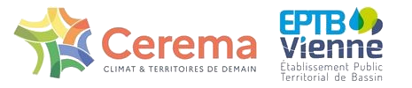

```{=html}
<div class="login-wrapper animated-login">
  <div class="login-card animated-card">
    
    

    <h2 class="login-title">Connexion</h2>
    <p class="login-subtitle-modern">Accès réservé aux utilisateurs autorisés</p>

    <form class="login-form">
      <label for="username">Identifiant</label>
      <input type="text" id="username" name="username" placeholder="Votre identifiant">

      <label for="password">Mot de passe</label>
      <input type="password" id="password" name="password" placeholder="Votre mot de passe">

      <button type="submit" class="login-btn-modern">Se connecter</button>
    </form>

  </div>
</div>

<style>
/* Animation fade-in + slide-up */
.animated-login {
  animation: fadeIn 1s ease forwards;
}

.animated-card {
  animation: slideUp 0.8s ease forwards;
  opacity: 0;
}

@keyframes fadeIn {
  from { opacity: 0; }
  to   { opacity: 1; }
}

@keyframes slideUp {
  from { transform: translateY(40px); opacity: 0; }
  to   { transform: translateY(0); opacity: 1; }
}

/* --- CONTENEUR GLOBAL --- */
.login-wrapper {
  height: 100vh;
  display: flex;
  justify-content: center;
  align-items: center;
  background: linear-gradient(135deg, #f0f4f8, #dfe7ec);
  padding: 20px;
}

/* --- CARTE VERRE --- */
.login-card {
  width: 380px;
  padding: 40px 35px;
  border-radius: 18px;
  background: rgba(255,255,255,0.55);
  box-shadow: 0 8px 32px rgba(0,0,0,0.15);
  border: 1px solid rgba(255,255,255,0.35);

  /* Effet verre compatible Firefox */
  position: relative;
  overflow: hidden;
}

.login-card::before {
  content: "";
  position: absolute;
  inset: 0;
  background: rgba(255,255,255,0.35);
  filter: blur(18px);
  z-index: -1;
}

/* --- LOGO --- */
.login-logo-modern {
  width: 180px;
  margin-bottom: 20px;
  display: block;
  margin-left: auto;
  margin-right: auto;
}

/* --- TITRE --- */
.login-title {
  font-family: "Inter", "Avenir", sans-serif;
  font-size: 1.8rem;
  font-weight: 600;
  margin-bottom: 10px;
  text-align: center;
  color: #333;
}

/* --- SOUS-TITRE --- */
.login-subtitle-modern {
  text-align: center;
  color: #555;
  margin-bottom: 25px;
  font-size: 0.95rem;
}

/* --- FORMULAIRE --- */
.login-form label {
  display: block;
  margin-top: 15px;
  font-weight: 600;
  color: #333;
  font-family: "Inter", sans-serif;
}

.login-form input {
  width: 100%;
  padding: 12px;
  margin-top: 6px;
  border-radius: 10px;
  border: 1px solid #ccc;
  background: #f9f9f9;
  font-size: 1rem;
  transition: all 0.25s ease;
}

.login-form input:focus {
  border-color: #ef7757;
  background: #fff;
  box-shadow: 0 0 0 3px rgba(239,119,87,0.25);
  outline: none;
}

/* --- BOUTON --- */
.login-btn-modern {
  width: 100%;
  margin-top: 30px;
  padding: 14px;
  background: #ef7757;
  color: white;
  border: none;
  border-radius: 12px;
  font-size: 1.1rem;
  font-weight: 600;
  cursor: pointer;
  transition: all 0.25s ease;
}

.login-btn-modern:hover {
  background: #d96548;
  box-shadow: 0 6px 18px rgba(239,119,87,0.35);
}

/* --- RESPONSIVE --- */
@media (max-width: 480px) {
  .login-card {
    width: 90%;
    padding: 30px 25px;
  }
}

</style>

```
